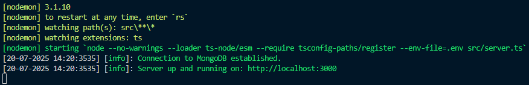

# my-reserva-api

This is a <b>Node.js + Express</b> backend with <b>Typescript</b> for "myReserva" full stack personal project. <br>
Frontend part repo link: https://github.com/CharioMich/myReserva-app <br>

## Run instructions
#### To run the API: 🚀
  - Clone the repo:
  ``` git clone git@github.com:CharioMich/my-reserva-api.git ``` (SSH)
  - In the root directory, in a terminal run ``` npm install ```
  - In the root directory (where src lives), create a .env file ``` touch .env ```
  - Copy the .env.example variables into .env and set the variables accordingly. <br>
  for this step you will need to have a MondoDB cluster so you can provide the connection string
  - After setting up the env variables, run in the terminal ``` npm run dev ```
  - You should see in the terminal something like: <br>
  
  - Optionally, browse to http://localhost:3000/api/api-docs/ (change port if running other than 3000) for Swagger API documentation.

#### ⚠️ Note: 
In its current state the app only runs in development mode. The context is strictly Typescript and the files do not compile to js. In case of a real-life deployment scenario we would adjust `package.json` and `tsconfig.json` accordingly, but for the sake of type safety and convenient hot reloading with `nodemon` during development, we stick to the current settings.

---

### 📁 Project Structure

```bash
my-reserva-api/
│
├── dist                # compiled typescript output files
├── node_modules
├── postman             # postman files
├── src/
│   ├── assets/         # Static files (img for README.md)
│   ├── controllers/    # Route handler logic
│   ├── lib/            # Utility libraries / helpers
│   ├── middlewares/    # Custom Express middlewares
│   ├── models/         # Mongoose schemas 
│   ├── routes/         # Express route definitions
│   ├── types/          # TypeScript type declarations 
│   ├── validators/     # Request validation logic 
│   ├── server.ts       # Entry point 
│   └── swagger.ts      # Swagger setup file 
│
├── .env                # Environment variables
├── .env.example        # .env example file for GitHub repo
├── .prettierignore
├── .prettier
├── LICENSE
├── nodemon.json        # nodemon configuration file
├── .gitignore
├── package-lock.json
├── package.json
├── README.md
└── tsconfig.json       # TypeScript configuration file
```


---

### Postman

A Postman collection and environment to test the API is included under the `postman` directory.

#### How to Use:

1. Open Postman.
2. Import the collection: `postman/myReserva.postman_collection.json`.
3. Import the environment: `postman/myReserva.postman_environment.json`.
4. Select the environment and run requests.